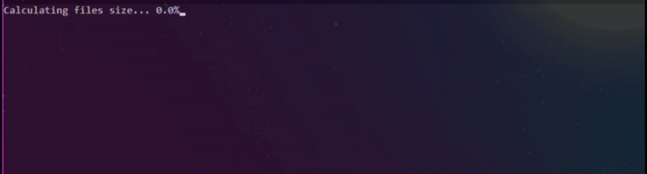

# PDF to pandas large table-like data convertion 

## Input files

Large PDF files (2k-4k pages per file). All files have a similar structure. Formed as a legacy from office tables.

## Goals

- get a file of table-like data, with the ability to use with *pandas*
- prevent *"out-of-memory"* error
- save the results to a file in a size-insensitive format
- be able to track progress and estimated time

## Solution

1. Count the number of pages of each file
2. Split page range for part-by-part convertion (single page makes slowly)
3. Convert part with attaching to common dataframe
4. Save complete dataframe to pickle file

